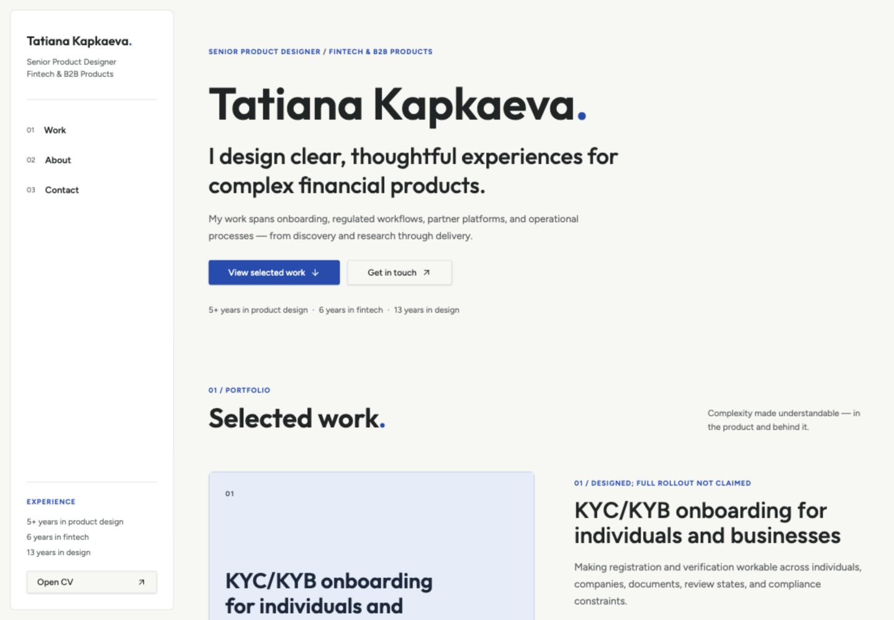
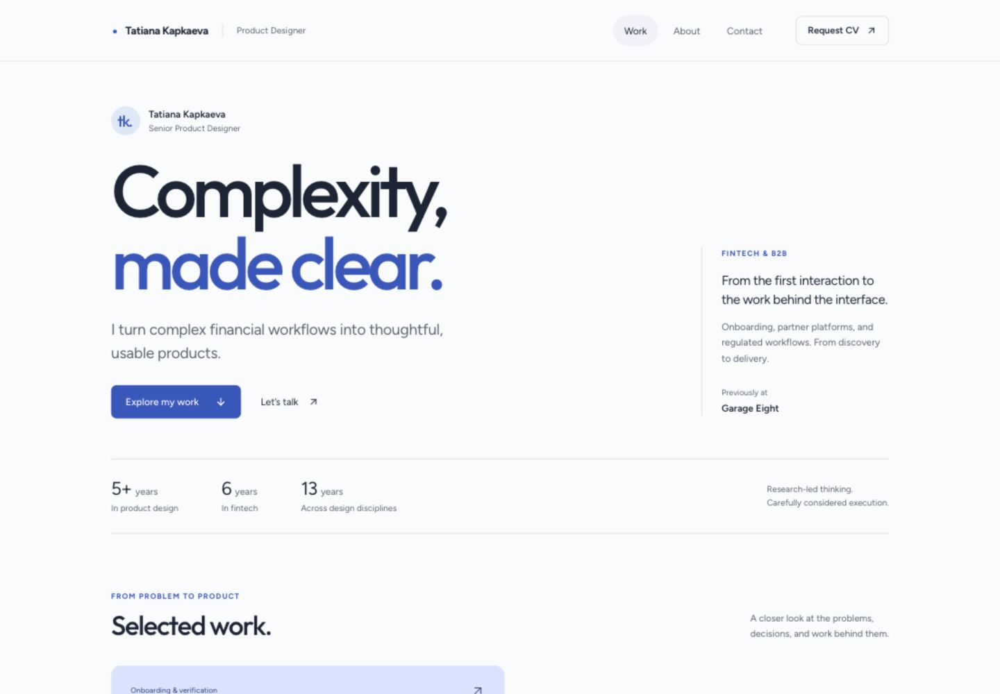
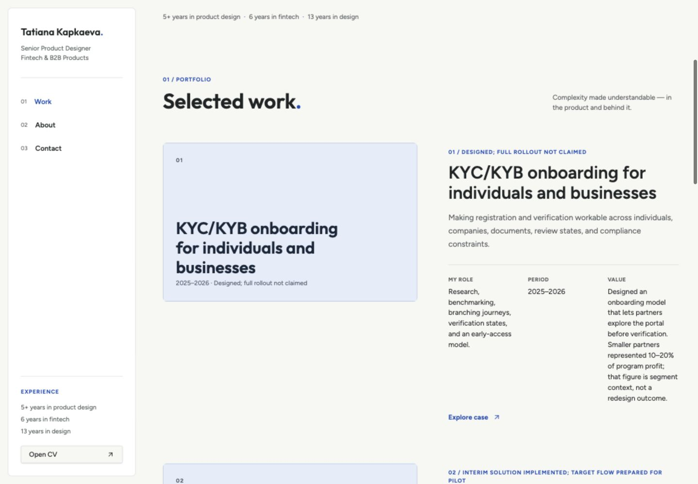
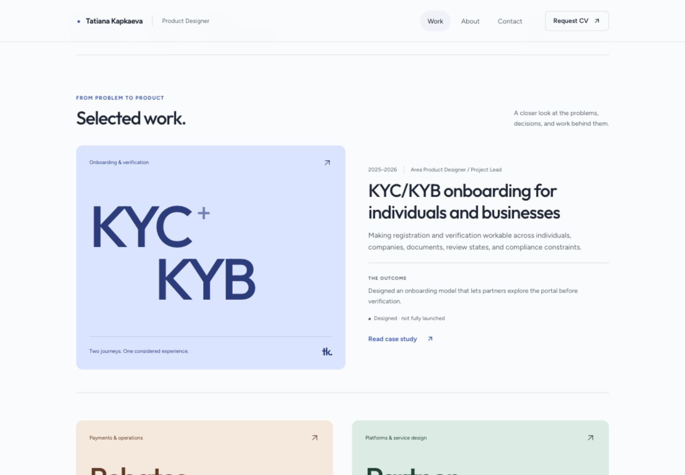
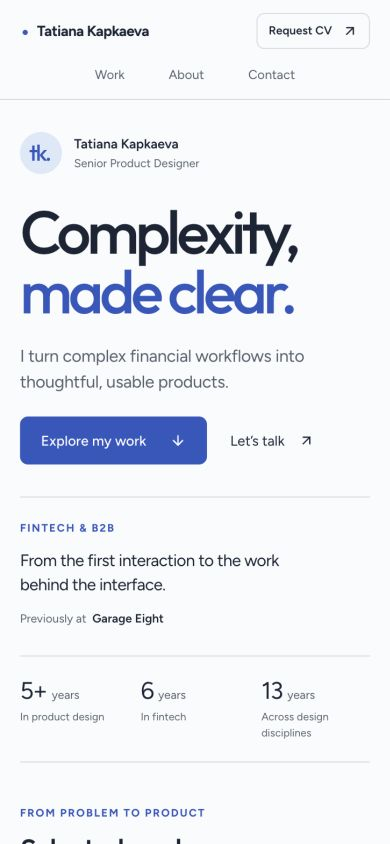
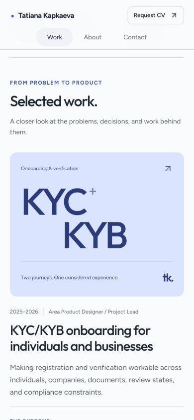

# Обновление портфолио Татьяны Капкаевой
Дата: 26 сентября 2026.

Предпросмотр: http://127.0.0.1:8081/
Исходная версия: http://localhost:8080/ — запущена из соседней папки, без «копия» в названии.
Изменения внесены в проект, подключённый к этой задаче.

## Задача страницы
Помочь нанимающему менеджеру быстро понять специализацию, масштаб ответственности и выбрать кейс. Последовательность: позиционирование → избранные проекты → исследования и стратегия → подход и опыт → контакт.

## Наблюдения и исправления
1. Первый экран: постоянная боковая панель дублировала опыт и сжимала основной контент. Вместо неё — компактная верхняя навигация, выразительное позиционирование и единая полоса опыта.
2. Выбор кейса: одинаковые текстовые обложки повторяли соседний заголовок, а вклад и результат читались в узких колонках. Теперь один ведущий кейс и два дополнительных, тематические типографические обложки, роль, описание, результат и стадия.
3. Исследования и стратегия: два дополнительных кейса вынесены в самостоятельный блок с подтверждёнными результатами из существующего контента.
4. Контакт: email и Telegram представлены как понятные действия. Файл CV по исходному пути Lovable локально возвращает 404; при его недоступности доступен Request CV через почту. При наличии доступного PDF отображается Open CV.

## Визуальная система
Холодный почти белый фон, тёмно-синий текст, синий основной акцент; светлые фоны обложек различают темы. Сохранены шрифты Outfit и Figtree. Единая сетка и более короткие превью снижают нагрузку при просмотре. Обложки типографические: реальных изображений продукта в опубликованных кейсах пока нет; загруженная обложка автоматически имеет приоритет.

## Примеры для насмотренности
- [Eugen Trapeznikov](https://eugenproductdesign.vercel.app/): задача и результаты уже в превью кейса.
- [Alex Vu](https://www.alexvustudio.com/): сдержанная типографика, простая навигация, небольшой отбор проектов.
- [Jules Bennett](https://julesdbennett.com/): выразительное позиционирование, компактные факты и заметные результаты.
- [Paula Rigoli](https://paularigoli.com/): характер через типографику и цвет, ясные действия и личный вклад в кейсах.

Это наблюдения по конкретным портфолио, а не утверждение о единственном актуальном стиле.

## До и после
### Первый экран, 1440 × 1000

### Кейсы, 1440 × 1000

### Телефон, 390 × 844

## Проверено
- Отображение и отсутствие горизонтальной прокрутки на 320, 390, 800 и 1440 px.
- Отсутствие обрезки содержимого обложек на 320 px.
- Навигация к работам и контактам; подсветка текущего раздела.
- Открытие ведущего кейса и его содержимого.
- Переход к основному содержимому с клавиатуры.
- Сохранение email и Telegram; корректный запасной сценарий для отсутствующего PDF.
- Сборка для публикации, TypeScript и lint изменённых основных компонентов проходят.
- Настройка reduced motion сохранена.

Проверка не является полным аудитом WCAG; отправка писем, чат, авторизация и изменение содержимого базы не выполнялись.

## Следующее содержательное улучшение
Добавить реальные экраны, фрагменты исследований и решений в кейсы. Они сильнее доказывают уровень продуктового дизайнера, чем декоративные обложки. Цифры результатов и стадии запуска не усилены и не придуманы.

